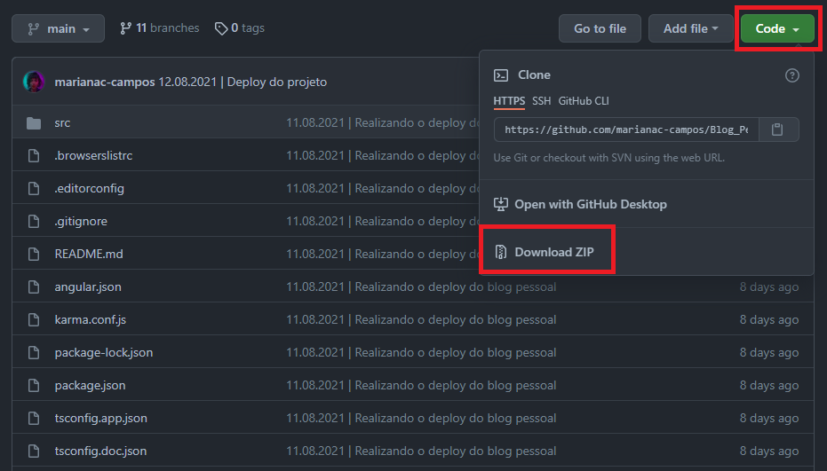
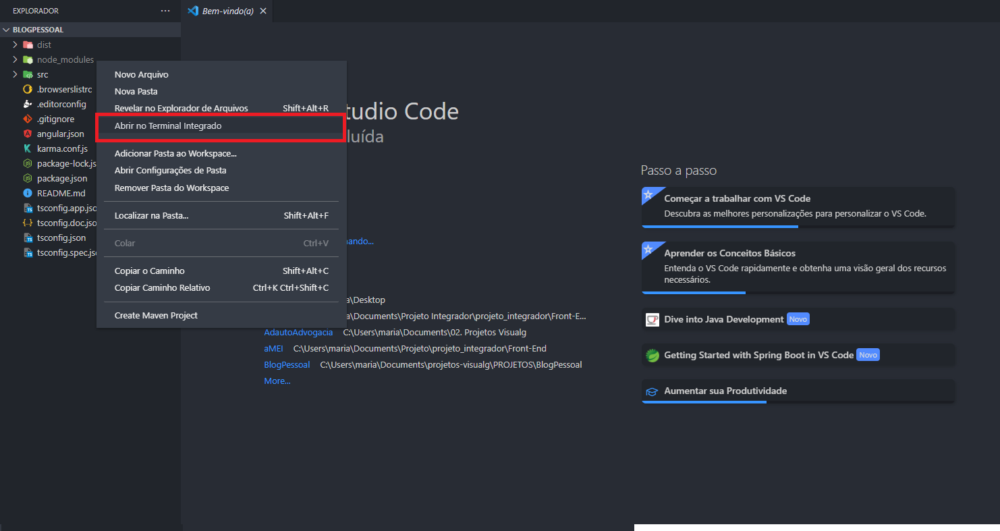
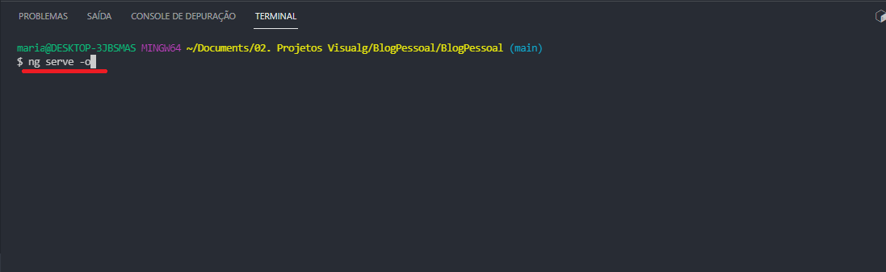

<h2 align="center">Repositório do Frontend do Blog Pessoal</h2>

<h4 align="center"> ✅ Frontend - Blog Pessoal 📝 Concluído ✅ </h4>
<h4 align="center"> Tudo em ordem! Qualquer atualização a mais será feito apenas no repositório do <a href="https://github.com/marianac-campos/Blog_Pessoal.v3">projeto final</a>.</h4>

----

## Demonstração 🎬 
Para rodar o projeto você pode ir para o repositório do [projeto final](https://github.com/marianac-campos/Blog_Pessoal.v3) onde já foi feito o deploy, OU, poderá baixar a versão zip do repositório e acessar pelo endereço [local](localhost:4200/#/login), ou se preferir `localhost:4200/#/login`.

PARA MAIS DETALHES SIGA O PASSO A PASSO 👇

<h3>1) Faça a instação do repositório</h3>

<h4>Depois disso, basta abrir com um programa de sua preferência (eu recomendo o <a href="https://code.visualstudio.com/download">Visual Studio Code</a>).</h4>
<h3>2) Após aberto, clique com o botão direito em baixo dos arquivo ou simplesmente dê um Ctrl + "</h3

<h33) Para finalizar escreva no console "ng serve -o" para iniciar (o '-o' abrirá automaticamente a aplicação)</h3

---

## Tecnologias Utilizadas 💻
- HTML5
- CSS3
- TypeScript
- [Angular](https://angular.io)

(Há outras tecnologias, mas as principais nesse primeiro momento foram essas!)

<h2>Autora 👩🏻‍💻</h2>

Feito com ❤️ por Mariana Campos 👋🏽 Entre em contato!

 

